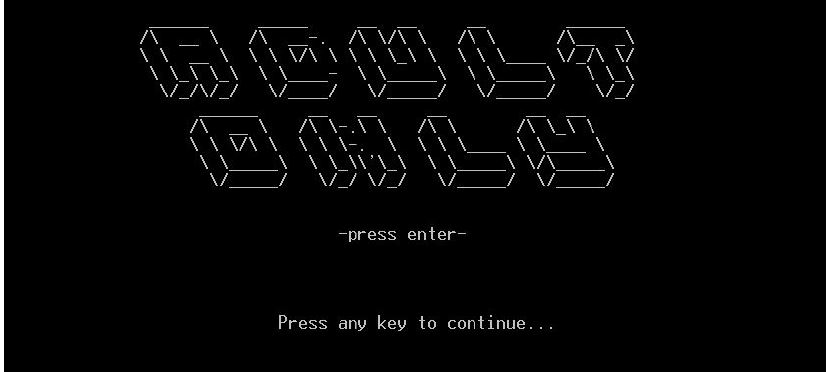
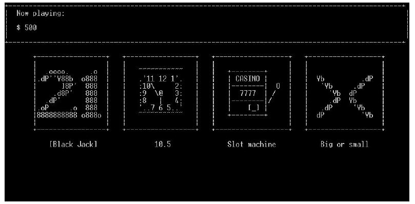
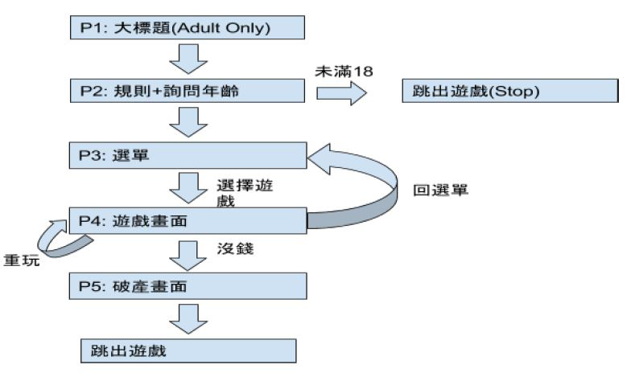

# MASM-Casino

**Using multi-modules**  
* main file : 
  * FP.asm 
* game file : 
  * twentyOne.asm
  * ten.asm
  * bs2.asm
  * sm2.asm 
* include file ( view file ) : 
  * card.asm
  * backCard.asm
  * topBar.asm
  * statusBar.asm
  * lose.asm 
* library file : 
  * mylib.inc 
* batch file: 
  * make2.bat 

**A casino game including**  
* Black Jack 
* 11 & half 
* Slot machine 
* Big and small 

**Screen Shot**
1. Start  

2. Menu  

3. Game flow  

  
Download 
[game.bat](URL "https://github.com/JarvisRu/MASM-Casino/blob/master/FP.exe") and 
[FP.exe](URL "https://github.com/JarvisRu/MASM-Casino/blob/master/game.bat"),
 then click game.bat to play 

  
> As final project for CE2012 Assembly Language 
> Cooperators : 104502205、104502550、104502535
